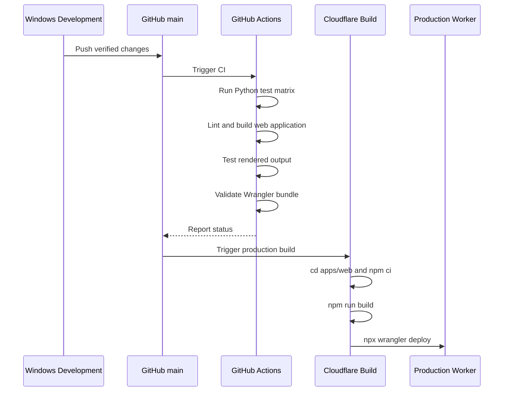

# CI/CD and Deployment Flow

```mermaid
sequenceDiagram
    participant Dev as Windows Development
    participant GH as GitHub main
    participant CI as GitHub Actions
    participant CF as Cloudflare Build
    participant Prod as Production Worker

    Dev->>GH: Push verified changes
    GH->>CI: Trigger CI
    CI->>CI: Run Python test matrix
    CI->>CI: Lint and build web application
    CI->>CI: Test rendered output
    CI->>CI: Validate Wrangler bundle
    CI-->>GH: Report status
    GH->>CF: Trigger production build
    CF->>CF: cd apps/web and npm ci
    CF->>CF: npm run build
    CF->>Prod: npx wrangler deploy
```
