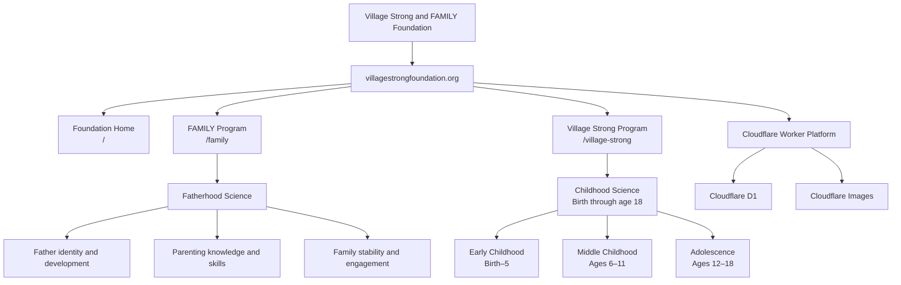

# Village Strong and FAMILY Foundation Architecture

## Program Distinction

| Route | Program | Specialization |
|-------|---------|---|
| `/family` | FAMILY | Fatherhood Science |
| `/village-strong` | Village Strong | Childhood Science, birth through age 18 |
| `/` | Foundation | Shared organizational entry point |
