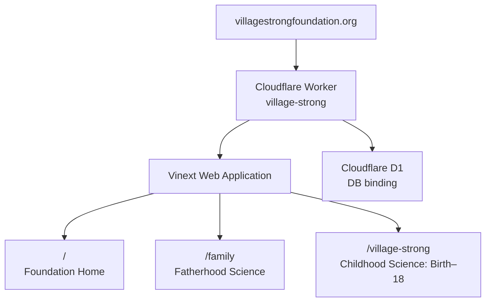

# Web Application Architecture

```mermaid
flowchart TD
    Domain["villagestrongfoundation.org"]
    Worker["Cloudflare Worker<br/>village-strong"]
    Application["Vinext Web Application"]

    Domain --> Worker
    Worker --> Application

    Application --> Home["/<br/>Foundation Home"]
    Application --> Family["/family<br/>Fatherhood Science"]
    Application --> Village["/village-strong<br/>Childhood Science: Birth–18"]

    Worker --> D1["Cloudflare D1<br/>DB binding"]
```
