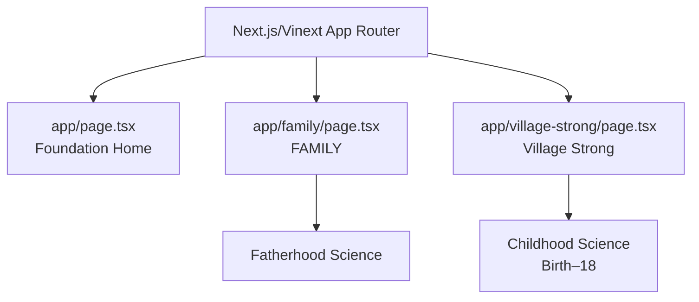

# Application Route Map

```mermaid
flowchart TD
    App["Next.js/Vinext App Router"]

    App --> Home["app/page.tsx<br/>Foundation Home"]
    App --> Family["app/family/page.tsx<br/>FAMILY"]
    App --> Village["app/village-strong/page.tsx<br/>Village Strong"]

    Family --> Fatherhood["Fatherhood Science"]
    Village --> Childhood["Childhood Science<br/>Birth–18"]
```
