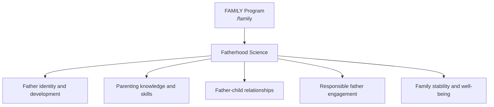

# FAMILY Program — Fatherhood Science

```mermaid
flowchart TD
    Family["FAMILY Program<br/>/family"]
    Family --> Science["Fatherhood Science"]

    Science --> Identity["Father identity and development"]
    Science --> Knowledge["Parenting knowledge and skills"]
    Science --> Relationships["Father-child relationships"]
    Science --> Engagement["Responsible father engagement"]
    Science --> Stability["Family stability and well-being"]
```
