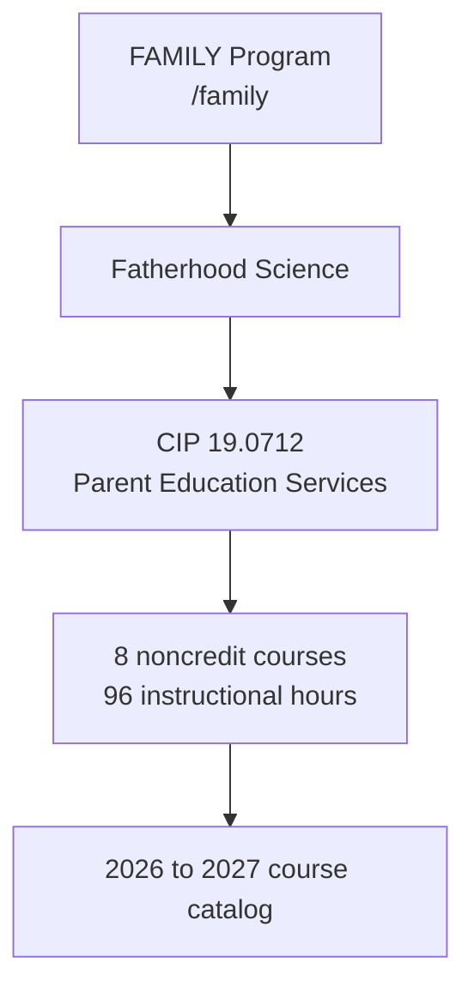

# FAMILY Program Fatherhood Science

```mermaid
flowchart TD
    Family["FAMILY Program<br/>/family"]
    Family --> Science["Fatherhood Science"]
    Science --> CIP["CIP 19.0712<br/>Parent Education Services"]
    CIP --> Courses["8 noncredit courses<br/>96 instructional hours"]
    Courses --> Catalog["2026 to 2027 course catalog"]
```
