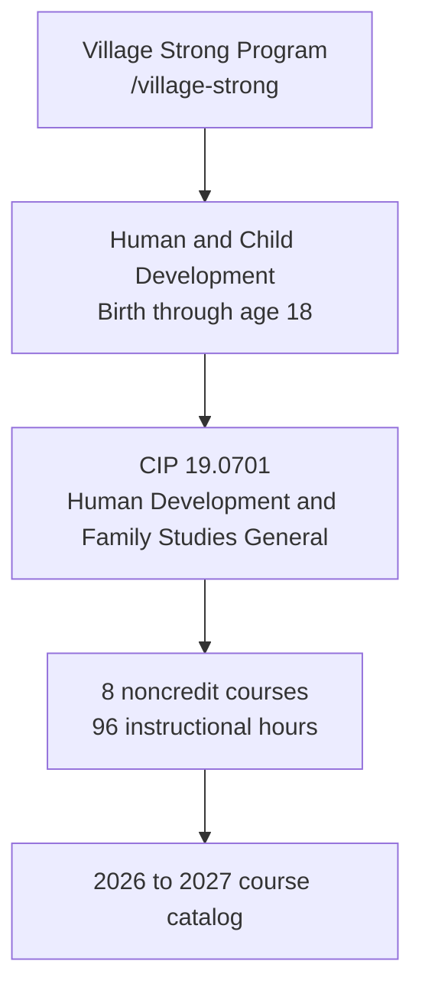

# Village Strong Program Childhood Science

```mermaid
flowchart TD
    Village["Village Strong Program<br/>/village-strong"]
    Village --> Science["Human and Child Development<br/>Birth through age 18"]
    Science --> CIP["CIP 19.0701<br/>Human Development and Family Studies General"]
    CIP --> Courses["8 noncredit courses<br/>96 instructional hours"]
    Courses --> Catalog["2026 to 2027 course catalog"]
```
