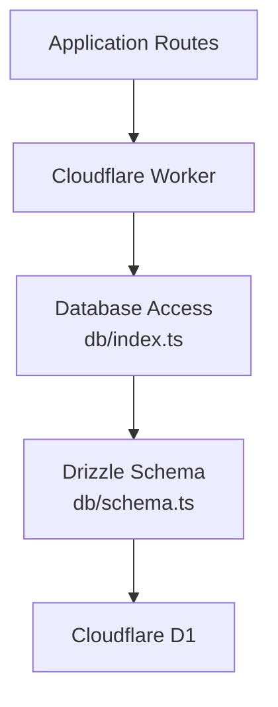

# Data Architecture

```mermaid
flowchart TD
    Pages["Application Routes"]
    Worker["Cloudflare Worker"]
    Access["Database Access<br/>db/index.ts"]
    Schema["Drizzle Schema<br/>db/schema.ts"]
    D1["Cloudflare D1"]

    Pages --> Worker
    Worker --> Access
    Access --> Schema
    Schema --> D1
```
