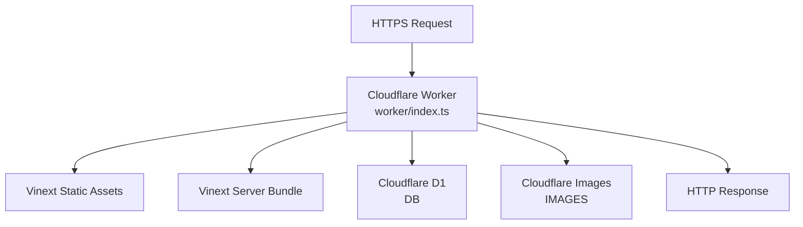

# Cloudflare Worker Architecture

```mermaid
flowchart TD
    Request["HTTPS Request"]
    Worker["Cloudflare Worker<br/>worker/index.ts"]

    Request --> Worker
    Worker --> Static["Vinext Static Assets"]
    Worker --> Server["Vinext Server Bundle"]
    Worker --> D1["Cloudflare D1<br/>DB"]
    Worker --> Images["Cloudflare Images<br/>IMAGES"]
    Worker --> Response["HTTP Response"]
```
