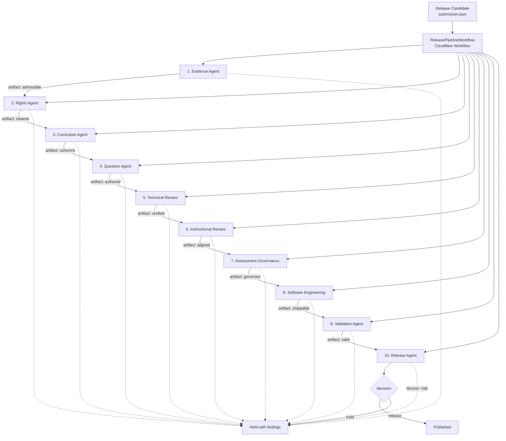
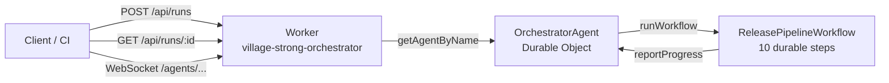

# Agent Orchestration Architecture

## Gate order

The sequence is a dependency chain, not a preference. Each agent reads the
artifacts its predecessors published, and the run stops at the first blocker.

| # | Agent | Blockers it can raise | Why it sits here |
|---|-------|-----------------------|------------------|
| 1 | Evidence | 001–006 | An uncited objective cannot be defended by any later stage |
| 2 | Rights | 001–006 | An unlicensed photograph cannot be fixed by editing questions |
| 3 | Curriculum | 001–006 | Every objective must be measurable and actually measured |
| 4 | Question | 001–012 | Every item must be gradable before anyone reviews its quality |
| 5 | Technical Review | 001–006 | Correctness and gradability of the authored bank |
| 6 | Instructional Review | 001–004 | Cognitive demand against the stated objectives |
| 7 | Assessment Governance | 001–006 | Fairness and coverage of the scored blueprint |
| 8 | Software Engineering | 001–005 | Representability in the delivery system; referential integrity |
| 9 | Validation | 001–003 | Re-derives the upstream gates instead of trusting them |
| 10 | Release | 001–003 | Grants the decision; refuses on an unclean record |

## Runtime topology

The Worker is deliberately a separate deployable from `village-strong`, which
owns `villagestrongfoundation.org`. A held release must never be able to take the
live website down, and vice versa.